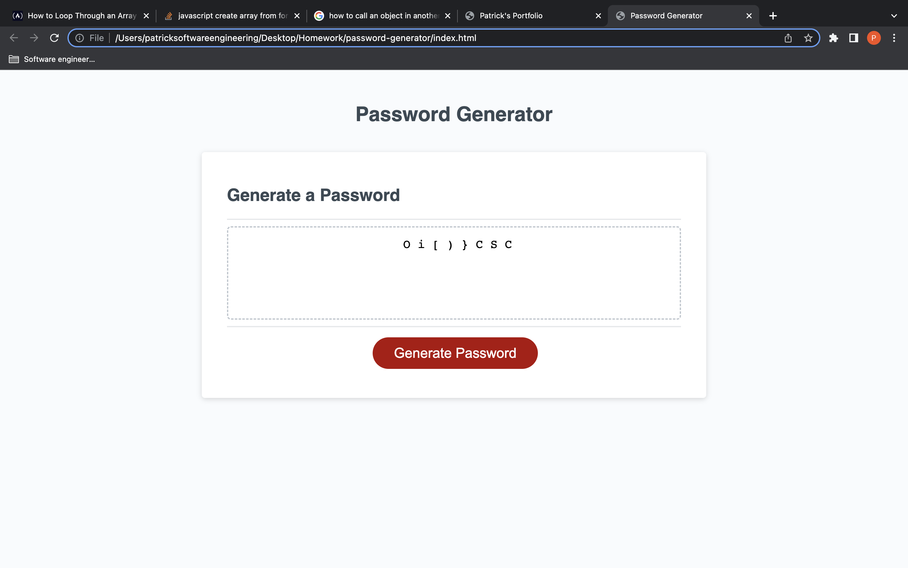

# password-generator

## Description
    This is an application that generates a random password from a series of user inputs;
    password can contain
        lower-case 
        upper-case 
        special-characters
        numbers
## How to improve
    I cannot figure out how to ensure a character the user wants is included in the password without increasing the password length. Currently the program takes random values from the possibleCharacters array.
## Screenshot

## link
[Deployed Site](https://pmorris50.github.io/password-generator/)
